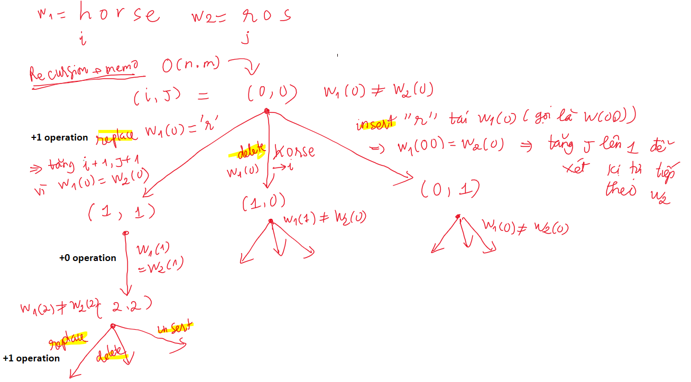
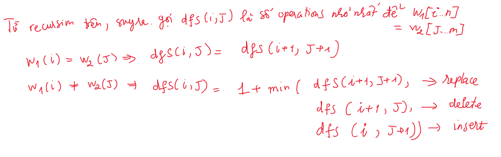
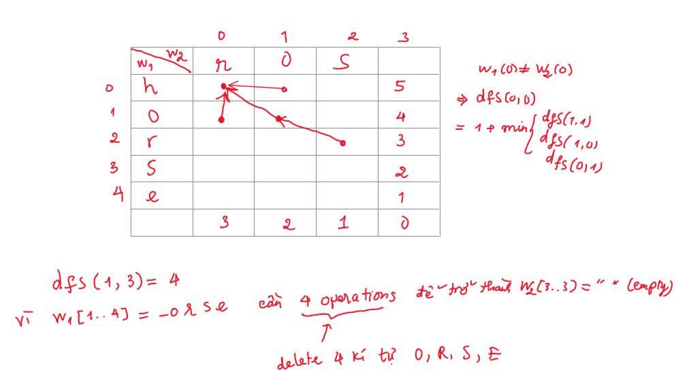

# 72. Edit Distance

* [Visit Leetcode problem](https://leetcode.com/problems/edit-distance/description/)

## Problem
```
Given two strings word1 and word2, return the minimum number of 
operations required to convert word1 to word2.
You have the following three operations permitted on a word:
    Insert a character
    Delete a character
    Replace a character
 

Example 1:
Input: word1 = "horse", word2 = "ros"
Output: 3
Explanation: 
horse -> rorse (replace 'h' with 'r')
rorse -> rose (remove 'r')
rose -> ros (remove 'e')

Example 2:
Input: word1 = "intention", word2 = "execution"
Output: 5
Explanation: 
intention -> inention (remove 't')
inention -> enention (replace 'i' with 'e')
enention -> exention (replace 'n' with 'x')
exention -> exection (replace 'n' with 'c')
exection -> execution (insert 'u')
 

Constraints:
0 <= word1.length, word2.length <= 500
word1 and word2 consist of lowercase English letters.
```

## Approach
**Tóm tắt đề bài:**
Cho 2 chuỗi string w1, w2. Tìm số `operations` nhỏ nhất có thể convert `w1 thành w2`.
Các `operations` có thể thực hiện trên chuỗi `w1`:
- Chèn thêm 1 kí tự mới
- Xoá 1 kí tự
- Thay thế 1 kí tự bất kì w1(i) thành 1 kí tự bất kì


Gọi `i`, `j` lần lượt là pointer index của `w1` và `w2` \
Gọi `dfs(i,j)` là số operations nhỏ nhất để biến `w1[i..n]` thành `w2[j..m]` với n, m lần lượt là chiều dài của w1, w2 \
Ta lần lượt so sánh các kĩ tự `w1(i)` và `w2(j)` xem chúng có bằng nhau hay là không? Từ đó lựa chọn action tương ứng (có thể xem hình 1) \
Như hình 1, `w1(0) != w2(0)` nên ta có 3 lựa chọn:
- Replace `w1(0)` thành `r` => `tăng i, j lên 1` vì sau operation này thì w1(0) = w2(0)
- Delete `w1(0) = h` => `chỉ tăng i lên 1, j giữ nguyên` vì ta vẫn cần so sánh kí tự tiếp theo w1(i+1) với w2(j)
- Insert kí tự `r` trước vị trí `w1(0)` => `giữ nguyên i, chỉ tăng j lên 1` vì lúc này `w2(0) = kí tự 'r' vừa insert ở w1`



Từ cây đệ quy trên, ta dễ dàng tìm được công thức quy hoạch động hoặc là công thức đệ quy
Gọi `dfs(i,j)` là số operations nhỏ nhất để biến `w1[i..n]` thành `w2[j..m]` với n, m lần lượt là chiều dài của w1, w2 \
- `dfs(i, j) = dfs(i+1, j+1)` nếu w1(i) = w2(j)
- `dfs(i, j) = 1 + min(dfs(i+1, j+1), dfs(i+1, j), dfs(i, j+1))` nếu w1(i) != w2(j)


Với công thức đệ quy ở trên, ta dễ dàng biến cấu trúc cây đệ quy trên thành dạng bảng như hình
Ngoài ra, như hình trên ta có các `base case`, với ví dụ `dfs(1,3) = 4` đã được giải thích trên hình

## Implementation
### 1. Recursion + memorization
```java
class Solution {
    private String w1;
    private String w2;
    private Map<String, Integer> memo;

    public int minDistance(String word1, String word2) {
        this.w1 = word1;
        this.w2 = word2;
        this.memo = new HashMap<>();

        return dfs(0, 0);    
    }

    private int dfs(int i, int j) {
        // base case
        if (i == w1.length() && j == w2.length()) {
            return 0;
        }

        // if reach end w1 
        // => insert all remaining characters of w2 into w1 to make w1 = w2
        if (i == w1.length()) {
            return w2.length() - j; // insert remaining characters of w2
        } else if (j == w2.length()) {
            // if reach end w2 
            // => delete all remaining character of w1 to make w1 = w2
            return w1.length() - i; // delete all remaining characters of w1
        }

        String key = i + "_" + j;
        if (memo.containsKey(key)) {
            return memo.get(key);
        }

        int ans = Integer.MAX_VALUE;
        if (w1.charAt(i) == w2.charAt(j)) {
            ans = dfs(i+1, j+1);
        } else {
            ans = 1 + min(
                    dfs(i+1, j+1), // replace
                    dfs(i+1, j), // delete
                    dfs(i, j+1) // insert
                );
        }

        memo.put(key, ans);
        return ans;
    }

    private static int min(int a, int b, int c) {
        return Math.min(a, Math.min(b, c));
    }
}
```
### Dynamic programming
```java
class Solution {
    /**
     * After solved problem by using recursion + memo => just transform it to dp easily
     */
    public int minDistance(String word1, String word2) {
        int n = word1.length(); int m = word2.length();
        int[][] dp = new int[n+1][m+1];

        // base case
        for (int i = 0; i <= n; i++) {
            dp[i][m] = n - i;
        }
        for (int j = 0; j <= m; j++) {
            dp[n][j] = m - j;
        }

        // dp
        for (int i = n-1; i >= 0; i--) {
            for (int j = m-1; j >= 0; j--) {
                if (word1.charAt(i) == word2.charAt(j)) {
                    dp[i][j] = dp[i+1][j+1];
                } else {
                    dp[i][j] = 1 + min(
                            dp[i+1][j+1], // replace
                            dp[i+1][j], // delete
                            dp[i][j+1] // insert
                    );
                }
            }
        }

        return dp[0][0];
    }
    
    private static int min(int a, int b, int c) {
        return Math.min(a, Math.min(b, c));
    }
}
```