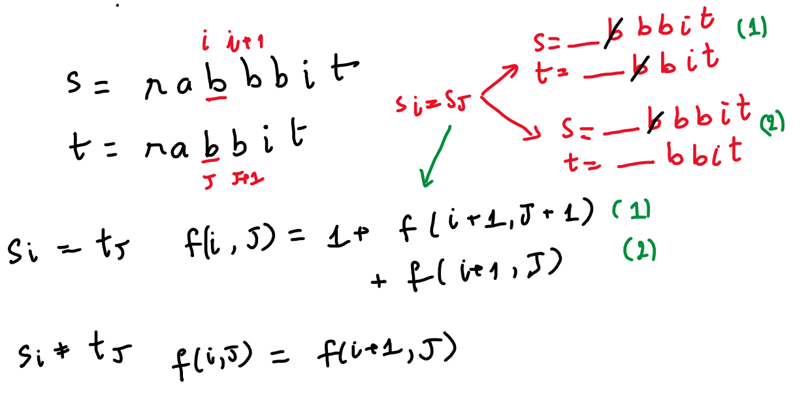

# 115. Distinct Subsequences

* [Visit Leetcode problem](https://leetcode.com/problems/distinct-subsequences/description/)

## Problem
```
Given two strings s and t, return the number of distinct subsequences of s which equals t.

The test cases are generated so that the answer fits on a 32-bit signed integer.

 

Example 1:

Input: s = "rabbbit", t = "rabbit"
Output: 3
Explanation:
As shown below, there are 3 ways you can generate "rabbit" from s.
rabb[b]it
ra[b]bbit
rab[b]bit
Example 2:

Input: s = "babgbag", t = "bag"
Output: 5
Explanation:
As shown below, there are 5 ways you can generate "bag" from s.
ba[b]g[bag]
ba[bgba]g
b[abgb]ag
[ba]b[gb]ag
[babg]bag

* Note: character in square bracket is removed to make s = t
```

## Approach

Xét ví dụ: \
s = rabbbit \
t = rabbit \
Đề bài bảo tìm số "subsequence" của s sao cho giống với t \
Gọi `(i, j)` lần lượt là index của `s` và `t` \
Gọi `f(i,j)` là số subsequence của chuỗi `s[i..n]` giống với chuỗi `t[j..m]` với n, m là chiều dài của s và t 


## Implementation
### 1. Recursion + memorization
```java
class Solution {

    private String s;
    private String t;
    private Map<String, Integer> memo;

    public int numDistinct(String s, String t) {
        this.s = s; this.t = t;
        this.memo = new HashMap<>();

        return dfs(0, 0);
    }

    private int dfs(int i, int j) {
        String key = i + "_" + j;
        if (memo.containsKey(key)) return memo.get(key);

        // base case
        // s = "" and t = "abc" => no ways to make s = t
        if (i == s.length() && j < t.length()) {
            return 0;
        }
        
        // remaining case whenever t = "" => 1 way
        if (j == t.length()) {
            return 1;
        }

        // logic
        int ans = 0;
        if (s.charAt(i) == t.charAt(j)) {
            ans += dfs(i+1, j+1) + dfs(i+1, j);
        } else {
            ans += dfs(i+1, j);
        }

        memo.put(key, ans);
        return ans;
    }
}
```
## 2. DP
```java
class Solution {
    // convert DFS => dp using 2D matrix
    public int numDistinct(String s, String t) {
        int n = s.length(); int m = t.length();
        int[][] dp = new int[n+1][m+1];

        // t = "" and s is not empty => 1 way to make s = t
        for (int i = 0; i < n; i++) {
            dp[i][m] = 1;
        }
        // s = "" and t is not empty => 0 way to make s = t;
        for (int j = 0; j < m; j++) {
            dp[n][j] = 0;
        }
        // s = "" and t = "" => 1 way to make s = t;
        dp[n][m] = 1;

        for (int i=n-1; i>=0; i--) {
            for (int j=m-1; j>=0; j--) {
                if (s.charAt(i) == t.charAt(j)) {
                    dp[i][j] += dp[i+1][j+1] + dp[i+1][j];
                } else {
                    dp[i][j] += dp[i+1][j];
                }
            }
        }

        return dp[0][0];
    }
}
```