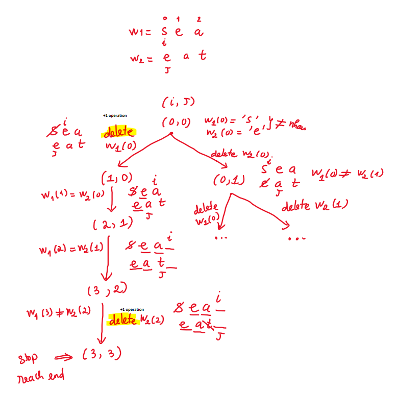
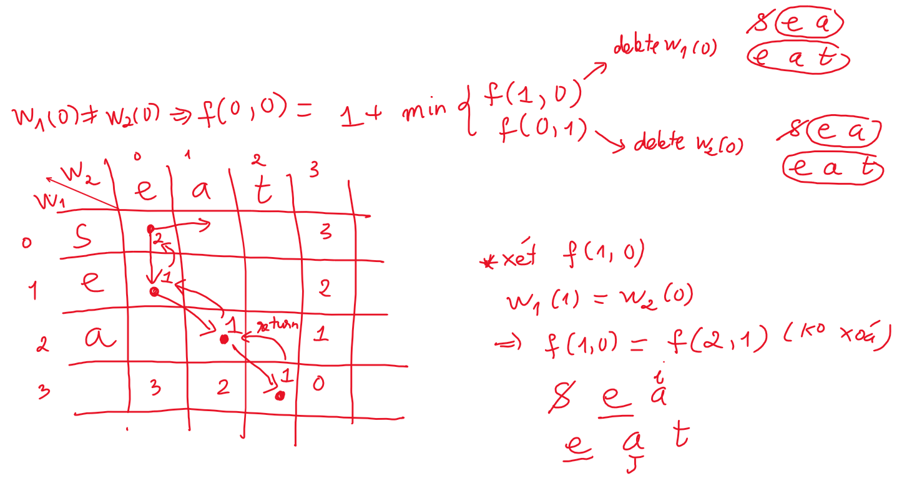

# 583. Delete Operation for Two Strings

* [Visit Leetcode problem](https://leetcode.com/problems/delete-operation-for-two-strings/description/)

## Problem
```
Given two strings word1 and word2, return the minimum number of steps required 
to make word1 and word2 the same.
In one step, you can delete exactly one character in either string.


Example 1:
Input: word1 = "sea", word2 = "eat"
Output: 2
Explanation: You need one step to make "sea" to "ea" and another step to make "eat" to "ea".

Example 2:
Input: word1 = "leetcode", word2 = "etco"
Output: 4

Constraints:
1 <= word1.length, word2.length <= 500
word1 and word2 consist of only lowercase English letters.
```

## Approach
**Tóm tắt đề bài:**
Cho 2 chuỗi string w1, w2. Mỗi lần ta có thể xoá bớt 1 kí tự bất kì của 1 trong 2 chuỗi.\
Tìm số thao tác xoá ít nhất để chuỗi `w1 = w2`


Đọc kĩ đề bài, mỗi lượt ta chỉ có thể có 2 action:
- Xoá một kí tự
- Không làm gì cả

Gọi `i`, `j` lần lượt là pointer index của `w1` và `w2` \
Ta lần lượt so sánh các kĩ tự `w1(i)` và `w2(j)` xem chúng có bằng nhau hay là không? Từ đó lựa chọn action tương ứng (có thể xem hình 1) \
Như hình 1, `w1(0) != w2(0)` nên ta có 2 lựa chọn:
- Xoá kí tự `w1(0)`. Ta so sánh các kí tự còn lại `w1 = _ea` và `w2 = eat`
- Xoá kí tự `w2(0)`. Ta so sánh các kí tự còn lại `w1 = sea` và `w2 = _at`

Tương tự như vậy cho đến khi `i, j` tiến tới hết chỗi (`i = w1.length và j = w2.length`)


Sau khi giải cách đệ quy ở trên, ta có thể mô hình hoá cách đệ quy ở trên bằng table \
Với hàm `f(i, j)` là số `operation nhỏ nhất` của chuỗi `w1[i..end]` và `w2[j..end]` \
Và công thức quy hoạch động như hình với 2 trường hợp:
- w1(i) != w2(j) => `f(i, j) = 1 + min(f(i+1, j), f(i, j+1)` 
- w1(i) = w2(j) => `f(i, j) = f(i+1, j+1)`

* Ngoài ra, vì sao `f(0, 3) = 3`. Thì ta cần ít nhất 3 thao tác xoá các kí tự `s`, `e`, `a` của `w1 = sea` để w1 trở thành `w2 = _` (empty). \
Tương tự, `f(n, j) = m - j (0 <= j <= m)` và `f(i, m) = n - i (0 <= i <= n)` với `n = word1.length và m = word2.length`

Có thể thấy công thức QHĐ rõ ràng ở phần implementation bên dưới
## Implementation
### 1. Recursion + memorization
```java
class Solution {
    private String word1;
    private String word2;
    private Map<String, Integer> memo;

    public int minDistance(String word1, String word2) {
        this.word1 = word1;
        this.word2 = word2;
        this.memo = new HashMap<>();

        return dfs(0, 0);
    }

    private int dfs(int i, int j) {
        // base case
        if (i == word1.length() && j == word2.length()) {
            return 0;
        }

        String key = i + "_" + j;
        if (memo.containsKey(key)) {
            return memo.get(key);
        }

        int ans = 0;

        // case: w1(i) = w2(j) => both increase (i,j)
        if (i < word1.length() && j < word2.length()
                && word1.charAt(i) == word2.charAt(j)) {
            ans = dfs(i+1, j+1);
        }
        // case: w1(i) != w2(j)
        else {
            if (i == word1.length()) {
                ans = 1 + dfs(i, j+1); // delete w2(j) => increase j
            } else if (j == word2.length()) {
                ans = 1 + dfs(i+1, j); // delete w1(i) => increase i
            } else {
                // delete w1(i) or delete w2(j)
                ans = 1 + Math.min(dfs(i+1, j), dfs(i, j+1));
            }
        }

        memo.put(key, ans);
        return ans;
    }
}
```
### Dynamic programming
```java
class Solution {
    public int minDistance(String word1, String word2) {
        int n = word1.length(); int m = word2.length();

        int[][] dp = new int[n+1][m+1];
        dp[n][m] = 0;
        for (int r = 0; r < n; r++) {
            dp[r][m] = n - r;
        }
        for (int c = 0; c < m; c++) {
            dp[n][c] = m - c;
        }

        for (int i = n-1; i >= 0; i--) {
            for (int j = m-1; j >= 0; j--) {
                if (word1.charAt(i) == word2.charAt(j)) {
                    dp[i][j] = dp[i+1][j+1];
                } else {
                    dp[i][j] = 1 + Math.min(dp[i+1][j], dp[i][j+1]);
                }
            }
        }

        return dp[0][0];
    }
}
```