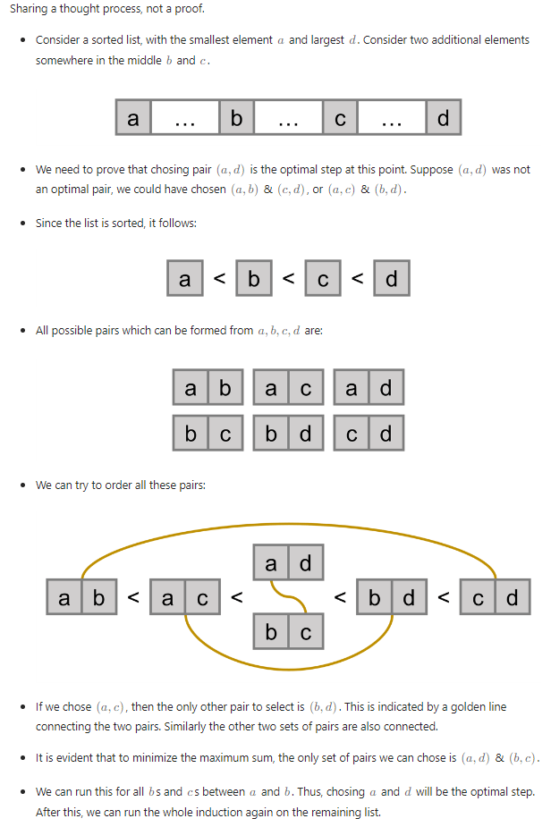

# 881. Boats to Save People

## Problem
```agsl
The pair sum of a pair (a,b) is equal to a + b. The maximum pair sum is the largest pair sum in a list of pairs.

For example, if we have pairs (1,5), (2,3), and (4,4), the maximum pair sum would be max(1+5, 2+3, 4+4) = max(6, 5, 8) = 8.
Given an array nums of even length n, pair up the elements of nums into n / 2 pairs such that:

Each element of nums is in exactly one pair, and
The maximum pair sum is minimized.
Return the minimized maximum pair sum after optimally pairing up the elements.

 

Example 1:
Input: nums = [3,5,2,3]
Output: 7
Explanation: The elements can be paired up into pairs (3,3) and (5,2).
The maximum pair sum is max(3+3, 5+2) = max(6, 7) = 7.

Example 2:
Input: nums = [3,5,4,2,4,6]
Output: 8
Explanation: The elements can be paired up into pairs (3,5), (4,4), and (6,2).
The maximum pair sum is max(3+5, 4+4, 6+2) = max(8, 8, 8) = 8.
 
Constraints:
n == nums.length
2 <= n <= 105
n is even.
1 <= nums[i] <= 105
```
## Intuition
- Tóm tắt đề bài: Có một mảng `nums` có số lượng phần tử là `n` chẵn. Từ trong mảng, tiến hành tạo thành 
các cặp `(nums[i], nums[j]) (i != j)`, ta được `n/2` cặp số và tìm `max sum` trong tất cả cặp số đó. 
Và có `X = 2Cn * 2Cn-2 * 2Cn-4 *...* 2C2` cách tạo cặp từ mảng `n` phần tử.
Từ trong `X` cách đó, tìm ra `max sum` bé nhất trong tất cả các cách
- Nghĩ đến phương pháp tham lam, do đề bài cần tìm `max sum nhỏ nhất trong tất cả các cách`, nên để cho cân bằng
mình sẽ ghép  cứ một số lớn nhất và một số nhỏ nhất là một cặp, một số lớn thứ 2 với một số nhỏ thứ 2 là 1 cặp,... Và vì sao cách này lại hiệu quả thì xem phần chứng minh bên dưới

## Approach
- Sort mảng, dùng 2 pointer `left`, `right` chạy từ đầu mảng và cuối mảng vào trung tâm để tạo thành các cặp và tìm `max sum`
- Tại sao dùng cách trên ta sẽ tìm được `minimized maximum pair sum` trong tất cả các cách ghép cặp?
  * Điều quan trọng trong đề bài ở chỗ `minimized`
  * Giả sử: `nums = [a, b, c, d, e, f]` đã được sort tăng dần
  * Ta có: `a < b < c < d < e < f`
  * Ta liền tạo thành các cặp `(a, f) (b, e) (c, d)` và tìm `max sum` ở 3 cặp này thì sẽ được đáp án `minimized maximum pair sum `
  * Và giả sử cặp cặp đó chính là `(b, e)`
  * Do mình có nhiều cách ghép cặp, mình cũng thể ghép thành 1 cách như này: `(a, c), (d, e), (b, f)`. Thì ra rõ ràng thấy: nếu cặp `(b, f)` 
  là cặp lớn nhất ở trong cách xếp này thì `(b, f)` không phải `max sum nhỏ nhất trong các cách` vì `(b+f) > (b+e)` (do `e < f`), cặp `(d, e)` cũng không phải đáp án vì `(d+e) > (b+e)` (do `d > b`). Còn cặp `(a, c)` là cặp nhỏ nhất trong 3 cặp `(a, c), (d, e), (b, f)`, không thể là `max sum` trong cách này nên ta không xét
  * => Vì vậy, ta ưu tiên ghép các cặp `đối xứng nhau` sau khi mảng đã sắp xếp tăng dần

Sau khi mình tự giải và tự giải thích theo luồng suy nghĩ, thì có đọc được một số comment
ở phần solution này: https://leetcode.com/problems/minimize-maximum-pair-sum-in-array/editorial/
khá hay, có thể đọc để hiểu hơn cách chứng minh (có cách tương tự của mình)

## Implementation

```java
class Solution {
    public int minPairSum(int[] nums) {
        int n = nums.length;
        int l = 0; int r = n-1;

        Arrays.sort(nums);

        // n is even so not need l <= r
        int maxSum = Integer.MIN_VALUE;
        while (l < r) {
            maxSum = Math.max(maxSum, nums[l] + nums[r]);
            l++; r--;
        }

        return maxSum;
    }
}
```